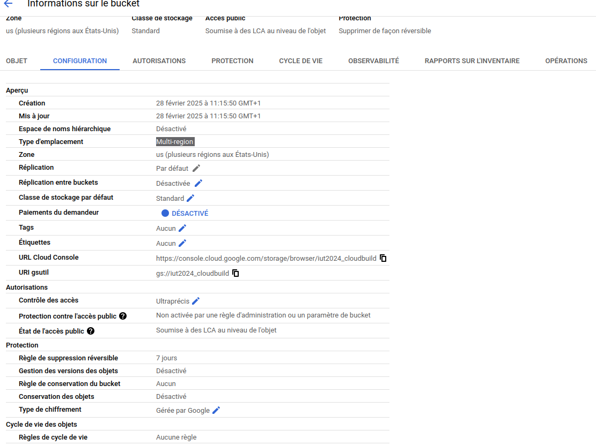
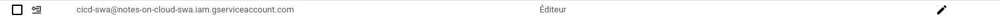

création d'un bucket en europe :

Le bucket s'est créé aux Us et non en europe comme je l'ai demandé, c'est le dockerFile qui se charge du bucket avec cette ligne :

    gcloud run deploy flask-app --image gcr.io/iut2024/flask-app --platform managed --region europe-west9 --allow-unauthenticated

droit gcp :

lien du github : 

https://github.com/simondestombes/ds

lien de l'app :

https://flask-app-160913999426.europe-west10.run.app/app/[mot]

